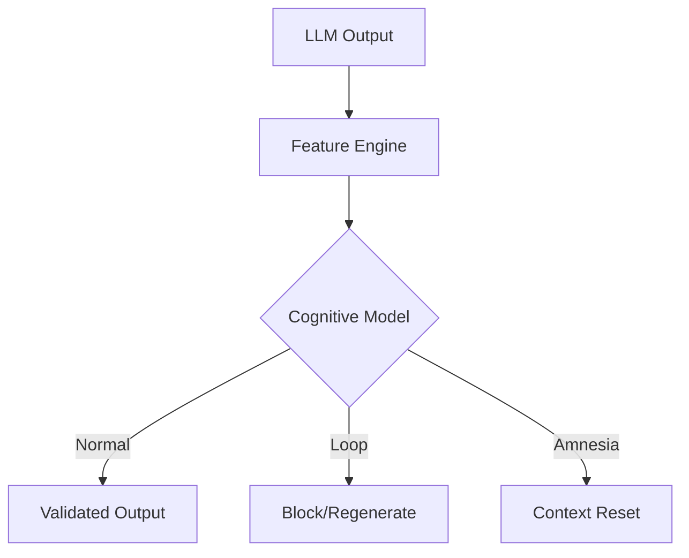

<div align="center">

# 🧠 YecoAI Cognitive Layer

### **LLMs fail silently. This layer doesn’t.**

**Anti-loop • Amnesia detection • Semantic stability**

<br/>

[](LICENSE)


<br/>


Developed by **[www.yecoai.com](https://www.yecoai.com)**

</div>

---

## ✨ Why do you need it?

When LLMs enter production, they fail in ways that traditional monitoring misses. They loop, they forget context (Amnesia), and they degrade into "word salad".

| Critical Failure | What happens? | How we fix it |
| :--- | :--- | :--- |
| **🔄 Infinite Loops** | Model repeats the same token or phrase forever. | **Loop Guard** detects structural and n-gram repetitions. |
| **😶 Context Amnesia** | Model ignores initial instructions or shifts topic. | **Keyword Persistence** monitors prompt-to-output alignment. |
| **📉 Semantic Drift** | Output becomes nonsensical or loses coherence. | **Stability Metrics** evaluate entropy and word distribution. |

---

## 📊 Benchmarks & Methodology (v1.0.0)

> **Engineering Note:** These results are derived from our **Robust 25-Case Stress Test**, specifically designed to simulate production failure modes that traditional LLM monitors often miss.

### Methodology
- **Stress Dataset:** 25 curated edge cases (Loops, Amnesia, Style Drift, False Positive stress tests).
- **Execution:** Pure Python deterministic evaluation (no LLM-calling-LLM overhead).
- **Objective:** High-precision detection of catastrophic failures with negligible latency.

| Metric | Result | Context |
| :--- | :--- | :--- |
| **Total Accuracy** | **96.00%** | 24/25 edge cases correctly identified. |
| **Loop Detection (F1)** | **1.00** | Zero false negatives on token/phrase loops. |
| **Normal (F1)** | **0.96** | High transparency for valid creative output. |
| **Amnesia (F1)** | **0.92** | Detects context loss within ~0.5ms. |
| **Average RAM** | **24.95 MB** | Minimal footprint for edge/container. |
| **Latency (Avg)** | **1.76 ms** | Real-time protection without user-perceived delay. |

---

## 🧩 Core Capabilities

- 🔁 **Multi-level Loop Detector**
  Analyzes structural patterns, n-grams, and **Burstiness** (irregular repetitions).
- 🧠 **Amnesia Detection**
  Monitors contextual continuity and semantic coherence using **Keyword Persistence Tracking**.
- 🧯 **Semantic Stability Guard**
  Prevents meaning collapse and nonsensical text output using advanced "Word Salad" metrics.
- ⚡ **Performance Edge**
  Average RAM usage of only **24.95 MB**. Optimized for edge deployment.

---

## 🚀 Practical Examples

### 1. Installation
```bash
pip install yecoai-cognitive-layer
```

### 2. Protecting an LLM Chatbot (Production Pattern)
This example shows how to use the layer as a "Validator" for a standard LLM response.

```python
from yecoai_cognitive_layer import FeatureEngine, CognitiveModel

# 1. Setup the guards
engine = FeatureEngine()
model = CognitiveModel.load_from_json("weights.json")

def get_safe_llm_response(prompt):
    # Simulate an LLM call (e.g., OpenAI, Anthropic, or Local Llama)
    llm_output = call_your_llm_api(prompt) 
    
    # 2. Cognitive Validation
    vector, features = engine.extract_features(llm_output)
    prediction, scores = model.predict(vector, features)
    
    # 3. Decision Logic
    if prediction == "Loop":
        # If the LLM starts repeating itself, we trigger a retry or a fallback
        return "⚠️ [System Blocked a Loop] Please rephrase your request."
    
    if prediction == "Amnesia" or features['semantic_coherence'] < 0.25:
        # If the response is nonsensical or context is lost
        return "🧠 [Context Loss Detected] I'm having trouble following. Let's restart."

    return llm_output

# Usage
print(get_safe_llm_response("Write a long story about..."))
```

### 3. Agent Self-Correction Loop
For autonomous agents, you can use the layer to detect when the agent is "stuck" in a reasoning loop before it consumes too many tokens.

```python
agent_history = []

while agent_running:
    action = agent.think()
    
    _, features = engine.extract_features(action)
    
    if features['repetition_score'] > 0.7 or features['struct_loop_flag'] > 0.5:
        print("🚨 Agent Loop Detected! Injecting 'Break Loop' instruction.")
        agent.inject_system_message("You are repeating yourself. Stop and try a different approach.")
        continue
        
    agent.execute(action)
```
---

## 🤖 Supported Models & Ecosystems

The layer is **agnostic** and works with any text-generating system:
- **Proprietary:** OpenAI (GPT-5.4), Anthropic (Claude 4.7), Google (Gemini 3.1).
- **Open Source:** Llama 3 (8B/70B), Mistral/Mixtral, Phi-3, Qwen 3.
- **Local:** Ollama, LM Studio, vLLM.
- **Agents:** CrewAI, AutoGPT, Microsoft AutoGen.

---

## 🏗️ System Architecture




---

## 📄 License

This project is available under a dual licensing model:

### 🟢 Open Source (Apache 2.0)
Free for:
- Personal use
- Research
- Educational purposes

✔ Modification allowed  
✔ Redistribution allowed  

### 🔴 Commercial Use

Use in commercial environments (SaaS, paid products, enterprise systems) requires a commercial license.

See: [COMMERCIAL_LICENSE.md](./COMMERCIAL_LICENSE.md)

---

## 🌐 About Us: YecoAI

**YecoAI** builds next-generation cognitive systems focused on AI stability and safety.

**Website:** [www.yecoai.com](https://www.yecoai.com) | **Discord:** [Join Community](https://discord.gg/rBZscZtMvX)

<div align="center">

© 2026 **[www.yecoai.com](https://www.yecoai.com)**  
Original Author: **Marco (HighMark / YecoAI)**

</div>
